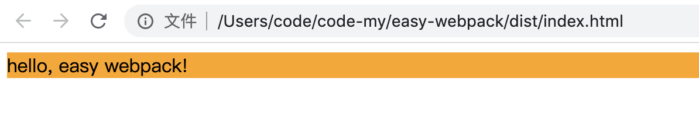
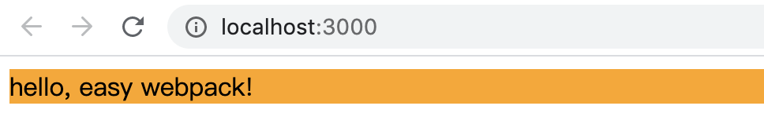

# easy-webpack
webpack 的最简单使用

本文用到 webpack4，webpack 号称0配置，确实也是这样。我觉得他的零配置是因为带了默认配置。

1、新建一个空目录，只要新建 src/index.js，写上一些代码。在命令行工具执行 webpack，它就会打出 dist/main.js 的文件。是的，连本地安装 webpack 也不用（当然全局安装使用的）。

不过这时打出来的是 product 的 mode 方式，要想在 dist/main.js 里看到你的代码，用 webpack --mode development

```javascript
// src/index.js
function fn() {
    return 10086;
}
let a = fn();
console.log(a - 1);
console.log(a + 1);
```


2、开始吧，根目录下新建 webpack.config.js，配置上

```javascript
// webpack.config.js
const path = require('path');

function getCurPath(p) {
    return path.join(__dirname, p)
}

module.exports = {
    entry: getCurPath('src/js/index.js'),
    output: {
        path: getCurPath('dist'),
        filename: 'main.js'
    }
}
```

然后 webpack --mode development，也是打包出了： dist/main.js，所以这就是默认它们的默认配置吧。

3、为了方便，把打包命令放进 package.json

```json
{
  "scripts": {
  	"start": "webpack --mode development",
  }
}
```

要用这种方式，那就要在本地安装，不然 npm run start 会报错：npm i webpack webpack-cli -S

4、引入 html-webpack-plugin

 npm i html-webpack-plugin -S

```javascript
// webpack.config.js
const path = require('path');
const HtmlWebpackPlugin = require('html-webpack-plugin');

function getCurPath(p) {
    return path.join(__dirname, p)
}

module.exports = {
    entry: getCurPath('src/index.js'),
    output: {
        path: getCurPath('dist'),
        filename: 'main.js'
    },
    plugins: [
        new HtmlWebpackPlugin({})
    ]
}
```

HtmlWebpackPlugin 的配置什么也不用写，然后就可以打包出来了 dist/index.html，可真厉害：

```html
<!DOCTYPE html>
<html>
  <head>
    <meta charset="UTF-8">
    <title>Webpack App</title>
  </head>
  <body>
  <script type="text/javascript" src="main.js"></script></body>
</html>
```

5、 引入html 和 css

先更改下配置文件如下：

```javascript
const path = require('path');
const HtmlWebpackPlugin = require('html-webpack-plugin');

function getCurPath(p) {
    return path.join(__dirname, p)
}

module.exports = {
    entry: getCurPath('src/js/index.js'), // index.js 放到 src/js 下
    output: {
        path: getCurPath('dist'),
        filename: 'main.[hash].js' // 加上 hash
    },
    module: {
      	// 引入 css 的 loader
        rules: [
            {
                test: /\.css/,
                use: ['style-loader', 'css-loader']
            }
        ]
    },
    plugins: [
        new HtmlWebpackPlugin({
            template: getCurPath('src/index.html'),
        })
    ]
}
```

需要安装：npm i style-loader css-loader -S

src/css/index.css

```css
.bg {
    background-color: orange;
}
```

srt/js/index.js 引入 index.css

```javascript
import '../css/index.css'; // 引入 css

function fn() {
    return 10086;
}
let a = fn();
console.log(a - 1);
console.log(a + 1);
```

src/index.html

```html
<!DOCTYPE html>
<html lang="en">
<head>
    <meta charset="UTF-8">
    <meta name="viewport" content="width=device-width, initial-scale=1.0">
    <title>easy webpack</title>
</head>
<body>
    <div class="bg">hello, easy webpack!</div>
</body>
</html>
```

打包：npm run start，打开打包后的文件：



nice，css 处理好了！

6、引入热更新

npm i webpack-dev-server -S

配置 package.json

```json
{
  "scripts": {
  	"start": "webpack --mode development",
    "dev": "webpack-dev-server --open --port 3000 --mode development"
  }
}
```

npm run dev，看：



OK 了


## 总结

弄出了一个基本的东西出来了：webpack+html+css+js

对应的提交是：

